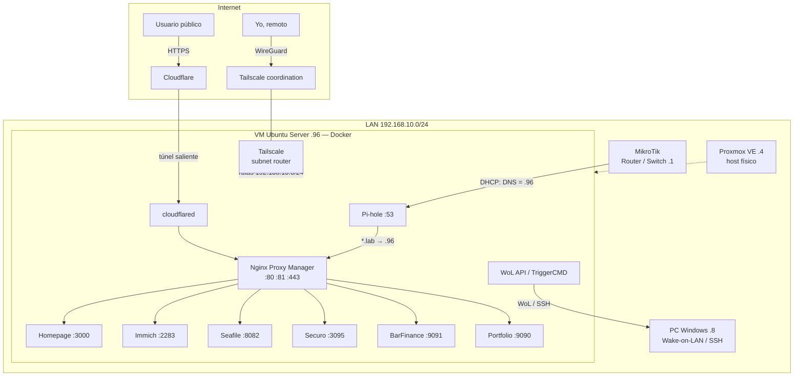

# 🏠 Homelab — Proxmox + Docker + Tailscale + Cloudflare Tunnels

Homelab personal para alojar mis propios servicios (fotos, ficheros, finanzas, DNS, portfolio) y proyectos propios, accesible de forma segura **sin abrir puertos para las webs ni para el acceso remoto**.

👉 **[Abre el mapa de red interactivo](https://alexxrc.github.io/homelab/network-map.html)**: del router del ISP a cada servicio, con escenarios animados.

Código fuente del mapa: [`network-map.html`](network-map.html). Para verlo en local, descarga el repo y abre ese archivo con el navegador.

> Este repositorio documenta la arquitectura de red, el hardware y los servicios desplegados, con *compose files* sanitizados para que puedas replicarlo.

## Resumen

| | |
|---|---|
| **Hardware** | HP EliteDesk 800 G4 SFF · i5-8500 (6 núcleos) · 8 GB RAM · SSD 480 GB |
| **Virtualización** | Proxmox VE 9 → VM Ubuntu Server 26.04 LTS (4 vCPU, 4 GB RAM, 362 GB disco) |
| **Contenedores** | Docker 29 + Compose v5, 27 contenedores activos (30 en total) en ~14 stacks |
| **Router** | MikroTik hEX (RouterOS 6.49), VLAN 10 `192.168.10.0/24`, tras el router del ISP (doble NAT) |
| **DNS** | Pi-hole (bloqueo de anuncios + DNS local `*.lab`) |
| **Reverse proxy** | Nginx Proxy Manager (dominios internos `.lab` y públicos) |
| **Acceso remoto** | Tailscale (subnet router) — acceso privado a toda la LAN |
| **Exposición pública** | Cloudflare Tunnel (`cloudflared`) — sin puertos abiertos |
| **Dashboard** | Homepage |
| **CI/CD** | GitHub Actions *self-hosted runner* en la propia VM |

## Arquitectura

Más detalle: [`docs/networking.md`](docs/networking.md) · [`docs/hardware.md`](docs/hardware.md) · [`docs/services.md`](docs/services.md)

## Servicios

| Categoría | Servicio | Puerto | Para qué |
|---|---|---|---|
| Red y sistema | Pi-hole | 53, 8080 | DNS de red, bloqueo de anuncios, DNS local |
| Red y sistema | Nginx Proxy Manager | 80/81/443 | Reverse proxy y certificados SSL |
| Red y sistema | Tailscale | — | VPN mesh + subnet router de la LAN |
| Red y sistema | Cloudflare Tunnel | — | Publicar webs sin abrir puertos |
| Dashboard | Homepage | 3000 | Panel central con estado de servicios |
| Media / nube | Immich | 2283 | Alternativa self-hosted a Google Photos |
| Media / nube | Seafile | 8082 | Almacenamiento privado en la nube |
| Finanzas | Securo | 3095 | Gestor de finanzas personales self-hosted |
| Proyectos propios | Portfolio | 9090 | Web personal (desplegada vía CI/CD) |
| Proyectos propios | BarFinance | 9091 | App Flask de gestión financiera |
| Proyectos propios | AvaloHost | — | Plataforma (API + Keycloak + PostgreSQL con pgBackRest) |
| Control PC | WoL API + TriggerCMD | — | Encender / reiniciar / apagar mi PC desde el dashboard o por voz |
| Ocio | Minecraft (Paper) + playit | 25565 | Servidor de juegos (parado cuando no se usa) |

## Cómo replicarlo

Guía paso a paso en [`docs/setup-guide.md`](docs/setup-guide.md). Resumen:

1. Instalar Proxmox y crear una VM Ubuntu Server.
2. Instalar Docker + Compose.
3. Levantar `pihole`, `nginx-proxy-manager` y `tailscale` (carpeta [`compose/`](compose)).
4. Apuntar el DHCP del router al Pi-hole como DNS y crear registros locales `*.lab`.
5. Crear los *proxy hosts* en NPM.
6. Aprobar la ruta de subred en la consola de Tailscale.
7. Añadir el resto de servicios y listarlos en Homepage.

## Seguridad

- Sin puertos de entrada para las webs: acceso privado por Tailscale, público por Cloudflare Tunnel. La única excepción verificada en el MikroTik es el DNAT del puerto 25565 (Minecraft, servicio parado). El router del ISP no se ha auditado.
- Secretos en `.env` (nunca en Git). Ver [`compose/.env.example`](compose/.env.example).
- Bases de datos solo en redes Docker internas, sin puertos publicados.
- Ver [`docs/lessons-and-next-steps.md`](docs/lessons-and-next-steps.md) para mejoras pendientes.

## Qué se puede hacer con todo esto

Ver [`docs/ideas.md`](docs/ideas.md): backups 3-2-1, monitorización, SSO con Keycloak, domótica, CI/CD propio, etc.

## Licencia

MIT
