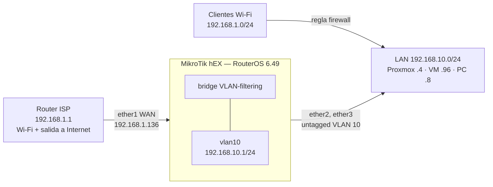

# Networking

## Topología física y lógica

La red está en **doble NAT**: el router del ISP (`192.168.1.1`) da Internet y Wi-Fi; el MikroTik cuelga de él por `ether1` (`192.168.1.136`) y gobierna la LAN del homelab.

| Equipo | IP | Rol |
|---|---|---|
| Router ISP | 192.168.1.1 | Salida a Internet, Wi-Fi doméstico |
| MikroTik hEX | 192.168.10.1 (LAN) · 192.168.1.136 (WAN) | Router, DHCP, firewall, VLAN |
| Proxmox VE | 192.168.10.4 | Hipervisor (UI en `:8006`) |
| VM `server` (Ubuntu) | 192.168.10.96 | Docker host: todos los servicios |
| PC Windows | 192.168.10.8 | Equipo de trabajo (WoL/SSH) |

## MikroTik: configuración relevante

- **VLAN 10** (`vlan10`, `192.168.10.0/24`) sobre un bridge con `vlan-filtering`. `ether2` y `ether3` son puertos *untagged* en la VLAN 10; `ether4`/`ether5` quedan en la VLAN 1 sin uso. Existe además la red por defecto `192.168.88.0/24`.
- **DHCP** (pool `192.168.10.10-100`): entrega gateway `192.168.10.1` y **DNS `192.168.10.96` (Pi-hole)**. La VM y el PC tienen *lease* fijo.
- **Ruta estática** `100.64.0.0/10 → 192.168.10.96`: lleva el tráfico de los clientes Tailscale a la VM, que actúa como subnet router.
- **Firewall (forward):** permite el Wi-Fi del ISP (`192.168.1.0/24`) hacia la VM `.96`, abre los puertos de streaming (Sunshine/Moonlight, 47984-48010) hacia el PC y descarta todo lo nuevo de WAN que no sea DNAT.
- **NAT:** *masquerade* por `ether1`, redirección del puerto **25565 → VM** (Minecraft) y redirección de **DNS (53 TCP/UDP) hacia Pi-hole** para quien use la IP WAN del MikroTik como DNS, con *masquerade* de retorno (hairpin).
- **Servicios de gestión** limitados: SSH y WinBox solo desde `192.168.10.0/24`; telnet y HTTPS deshabilitados.

## DNS

- El DHCP reparte Pi-hole como único DNS.
- Pi-hole resuelve dominios locales `*.lab` → `192.168.10.96` y reenvía el resto a un upstream público.
- Si Pi-hole cae, la LAN pierde DNS. Mitigación recomendada: segundo DNS de respaldo.

## Reverse proxy (Nginx Proxy Manager)

| Dominio | Destino |
|---|---|
| `dashboard.lab` | :3000 (Homepage) |
| `pihole.lab` | :8080 |
| `nginx.lab` | :81 (panel NPM) |
| `immich.lab` | :2283 |
| `seafile.lab` | :8082 |
| `securo.lab` | :3095 |
| `laterraza.lab` | :9091 |
| `alejandrorobotica.lab` | :9090 |

## Acceso remoto privado — Tailscale

Contenedor `tailscale` en `network_mode: host` como **subnet router**, anunciando `192.168.10.0/24`. Desde mi tailnet accedo a Proxmox, MikroTik y todos los servicios `.lab`. Requiere aprobar la ruta en la consola de Tailscale; para resolver `.lab` fuera de casa, usar Pi-hole como DNS en Tailscale.

## Exposición pública — Cloudflare Tunnel

Contenedores `cloudflared` crean túneles **salientes**; no hay *port forwarding* de entrada para las webs en el MikroTik. (El único DNAT que he verificado es el de Minecraft, 25565 → VM; los reenvíos del router del ISP no se han auditado.)

## Redes Docker

Una red bridge por stack (`immich_default`, `seafile_seafile-net`, `securo_default`, `avalohost_avalohost-internal`...), aislando bases de datos y workers. Solo se publican los puertos web necesarios.

## Control del PC (Wake-on-LAN)

`wol-api` (host network) envía el *magic packet* y ejecuta `shutdown`/`restart` por SSH (clave en solo lectura). `triggercmd` permite acciones por voz. Ambos aparecen en Homepage.
